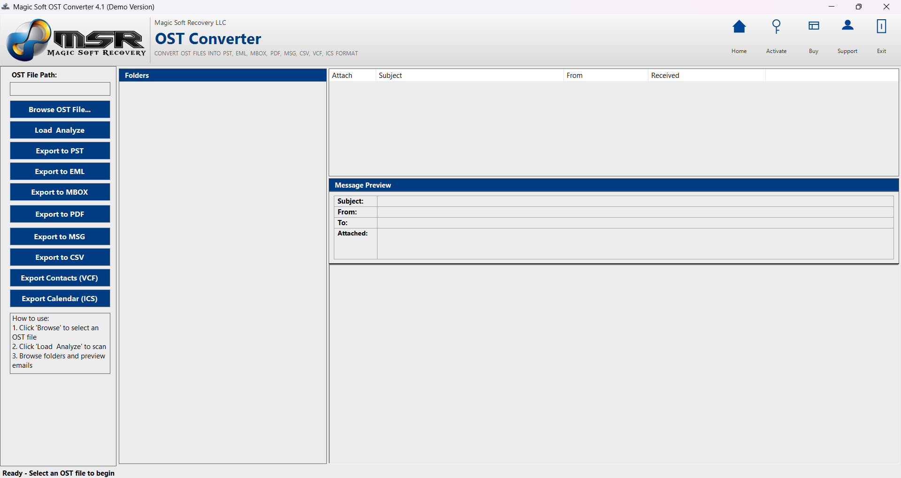
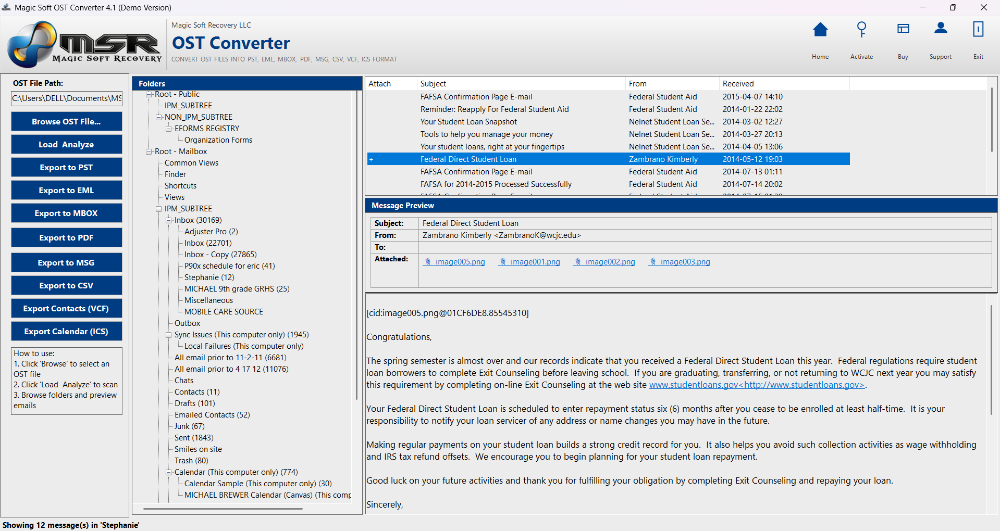
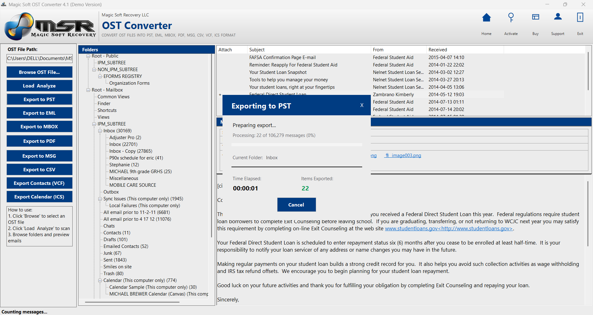

# ost-converter
Convert Orphaned &amp; Inaccessible OST Files to PST, MSG, EML &amp; PDF — No Exchange Server Required

  

🔵 **Magic Soft OST Converter 10.1**  
[Magic Soft OST Converter](https://www.magicsoftrecovery.com/ost-converter/)

**Convert Orphaned & Inaccessible OST Files to PST, MSG, EML & PDF — No Exchange Server Required**

*Trusted by IT Professionals, System Administrators & Enterprises Worldwide*

© 2016 – 2026 [Magic Soft Recovery LLC](https://www.magicsoftrecovery.com/)

 

[⬇️ Download Free Demo](#-download--free-demo) • [✨ Features](#-key-features) • [📖 How to Use](#-how-to-use--step-by-step) • [💻 System Requirements](#-system-requirements) • [❓ FAQ](#-frequently-asked-questions) • [📞 Contact](#-contact--support)

---

## 🔍 What is Magic Soft OST Converter?

**Magic Soft OST Converter 10.1** is a professional Windows utility developed by **Magic Soft Recovery LLC** — a company with decades of experience in data recovery and email conversion solutions.

This tool is built to do one thing exceptionally well: **convert orphaned, inaccessible, or corrupted OST files into clean, usable formats** including PST, MSG, EML, and PDF — **without requiring an active Exchange Server connection or Microsoft Outlook installation**.

Whether your OST file has become orphaned due to Exchange Server failure, damaged by synchronization errors, made inaccessible after a mailbox migration, or corrupted by system crashes — Magic Soft OST Converter extracts every piece of data and converts it into the format you need.

**Recover. Convert. Migrate. All in one tool — on any Windows machine.**

---

## 🚀 Why IT Teams & System Administrators Trust Magic Soft

OST files are critical for offline Exchange access, but they become inaccessible the moment the connection to Exchange Server is lost, the mailbox is deleted, or the server crashes. Most organizations face these scenarios during:

- **Exchange Server migrations** (on-premises to cloud or version upgrades)
- **Mailbox deletions** (employee departures, account cleanup)
- **Server failures** (hardware crashes, database corruption)
- **Synchronization errors** (OST-Exchange sync failures)
- **Profile corruption** (Outlook profile damage)

Most tools require an active Exchange connection or fail on orphaned OST files entirely. **Magic Soft OST Converter was engineered for exactly these worst-case scenarios.** It reads OST files directly, extracts every recoverable email, contact, calendar entry, task, and attachment, and delivers clean output — even when the file appears beyond recovery.

The result is a tool that doesn't just convert healthy OST files. **It rescues data from orphaned and inaccessible OST files that other tools cannot touch.**

---

## ✨ Key Features

### 📂 Output Formats Supported

| Output Format | Best Used For |
|---------------|---------------|
| **PST** | Convert OST to Outlook-compatible PST for easy import into any mailbox |
| **MSG** | Individual email files compatible with Outlook and other email clients |
| **EML** | Universal cross-platform email format for Thunderbird, Apple Mail, and more |
| **PDF** | Archive emails as PDF documents with full metadata for legal and compliance needs |

---

### ⚡ Core Capabilities

✅ **Orphaned OST File Conversion**  
Converts OST files that have lost connection to Exchange Server — no active Exchange connection, credentials, or domain access required.

✅ **Complete Email Data Recovery**  
Recovers every element of your emails — Subject, Date, Time, To, From, CC, BCC, and all attachments — exactly as they existed. Not a single field is left behind.

✅ **Full Mailbox Item Recovery**  
Recovers every item type stored in your OST file:
- 📥 Inbox emails with all attachments
- 📤 Sent items
- 🗑️ Deleted items
- 📝 Notes and memos
- 🚫 Junk folder
- 👤 Contacts
- ✅ Tasks
- 📅 Calendars and appointments

✅ **Corrupted OST File Handling**  
Specifically engineered to handle OST files suffering from:
- Synchronization errors
- Exchange Server crashes
- Mailbox deletion or migration
- Profile corruption
- Header corruption
- Files damaged during OS upgrades
- Hardware and software conflict damage

✅ **Tree-View Preview Interface**  
Before converting a single file, the demo and full version display your entire OST mailbox in a visual tree structure — browse every folder, read individual emails, and select exactly what you want to recover.

✅ **Selective Recovery**  
Choose to recover your entire mailbox or select specific folders, email ranges, or item types. Full control over what gets converted and where it goes.

✅ **Supports All Exchange Versions**  
Compatible with OST files created by Microsoft Exchange Server 2003, 2007, 2010, 2013, 2016, and 2019.

✅ **100% Local Processing**  
Every recovery and conversion operation runs entirely on your local machine. No data is uploaded to any external server. Your emails remain completely private throughout the entire process.

✅ **Automated Recovery Engine**  
Built-in automated features handle the complex extraction logic in the background — no technical expertise required. Load the file, preview the data, select your output, convert.

---

## 🎯 What Makes an OST File Inaccessible — And How Magic Soft Fixes It

Magic Soft OST Converter is specifically designed to address the most common causes of OST file inaccessibility:

| Issue | Magic Soft Solution |
|-------|---------------------|
| **Exchange Server Crash** | Extracts data from orphaned OST files without requiring server restoration |
| **Mailbox Deletion** | Recovers emails from OST files even after the Exchange mailbox is deleted |
| **Synchronization Errors** | Bypasses sync issues and reads OST data directly |
| **Profile Corruption** | Extracts mailbox data without requiring a working Outlook profile |
| **Header Corruption** | Repairs the file header and restores full accessibility |
| **OS Upgrade Failures** | Restores OST data damaged during Windows upgrade processes |
| **Hardware/Software Conflicts** | Extracts data from OST files made inaccessible by system conflicts |

---

## 👥 Who Needs Magic Soft OST Converter?

🏢 **IT Administrators & System Managers**  
Migrate user mailboxes during Exchange Server upgrades, recover data from deleted mailboxes, and convert orphaned OST files to PST for archiving — without requiring Exchange Server access.

⚖️ **Legal Professionals & Law Firms**  
Recover and convert email archives from former employees' OST files for e-discovery, litigation support, and court submissions. Every timestamp, sender, recipient, and attachment is preserved with forensic accuracy.

🏦 **Compliance & Records Management Teams**  
Convert OST files to PST or PDF for long-term storage in document management systems. Metadata integrity ensures records hold up under audit and regulatory scrutiny (GDPR, HIPAA, SOX).

🛠️ **Data Recovery Engineers**  
When clients send in hard drives with orphaned or damaged OST files, Magic Soft OST Converter is the professional-grade tool that extracts usable data even from severely corrupted archives.

👤 **Individual Users**  
Lost access to old Exchange emails after leaving a company, or after an Exchange Server migration? Magic Soft OST Converter lets you recover and export everything — contacts, calendars, tasks, and every email — without needing Exchange credentials.

---

## 📥 Download & Free Demo

⬇️ **[Download Free Demo — Magic Soft OST Converter 10.1](https://www.magicsoftrecovery.com/demo/magic-soft-ost-converter.exe)**

The free demo version gives you hands-on access to the full software interface and lets you see your recovered data before purchasing:

✔️ Load your OST file and view the complete folder tree  
✔️ Preview every recoverable email, contact, calendar, and attachment  
✔️ Test recovery on orphaned or corrupted files — see exactly what can be retrieved  
✔️ Evaluate conversion quality across all output formats  

💡 **Upgrade to the full version** for complete, unlimited recovery and conversion of all items — including inbox, sent items, deleted items, contacts, calendars, tasks, notes, memos, and junk folder — with priority support and lifetime updates.

---

## 📖 How to Use — Step by Step

Recovering and converting an OST file takes just a few minutes.

### Step 1 — Install & Launch
Install Magic Soft OST Converter on any Windows machine (XP through Windows 11). If Microsoft .NET Framework 8.0 is not present, the setup installer will install it automatically.

### Step 2 — Add Your OST File
Click **"Add OST File"** and browse to the location of your `.ost` file — whether it is an orphaned file from a deleted mailbox or a corrupted file that other tools have failed on.

### Step 3 — Scan & Preview
The software scans the OST file and displays all recoverable data in an interactive tree-view interface. Browse your Inbox, Sent Items, Deleted Items, Contacts, Calendar, Tasks, Notes, Junk folder — see exactly what is recoverable before committing to a conversion.

### Step 4 — Select Items for Recovery
Choose your entire mailbox, specific folders, individual emails, or any combination. The selective recovery feature ensures you convert only what you need.

### Step 5 — Choose Output Format
Select your target format:
- **PST** — to import into Outlook or another Exchange mailbox
- **MSG** — for Outlook-compatible individual email files
- **EML** — for cross-platform universal email access
- **PDF** — for archiving and legal documentation

### Step 6 — Convert & Save
Click **Convert**. The recovery engine processes your file, extracts all selected data, and saves perfectly organized output to your chosen destination folder — metadata intact, attachments included, folder structure preserved.

## 🖥️ Software Screenshots

---

## 📊 What Gets Recovered & Preserved

| Data Type | Recovered? |
|-----------|------------|
| Inbox Emails with Attachments | ✅ Yes |
| Sent Items | ✅ Yes |
| Deleted Items | ✅ Yes |
| Junk / Spam Folder | ✅ Yes |
| Contacts | ✅ Yes |
| Calendar & Appointments | ✅ Yes |
| Tasks | ✅ Yes |
| Notes & Memos | ✅ Yes |
| Subject Line | ✅ Yes |
| Date & Time Stamps | ✅ Yes |
| To / From / CC / BCC Fields | ✅ Yes |
| File Attachments | ✅ Yes |
| Folder Structure & Hierarchy | ✅ Yes |

---

## 💻 System Requirements

### Operating System Compatibility

Magic Soft OST Converter 10.1 is compatible with all major Windows versions:

| Windows Version | Supported |
|-----------------|-----------|
| Windows XP | ✅ |
| Windows Vista | ✅ |
| Windows 7 | ✅ |
| Windows 8 | ✅ |
| Windows 10 | ✅ |
| Windows 11 | ✅ |
| Windows 2000 | ✅ |
| Windows Server 2000 | ✅ |
| Windows Server 2003 | ✅ |
| Windows Server 2008 | ✅ |
| Windows NT | ✅ |

### Hardware & Software Requirements

| Requirement | Minimum | Recommended |
|-------------|---------|-------------|
| Processor | Pentium III / 800 MHz | Modern Intel/AMD processor |
| RAM | 256 MB | 1 GB or more |
| Display | 800 × 600 resolution | 1280 × 720 or higher |
| Disk Space | 200 MB free | 1 GB+ (for output files) |
| .NET Framework | 8.0 (auto-installed) | 8.0 |
| Microsoft Outlook | ❌ Not required | ❌ Not required |
| Exchange Server Connection | ❌ Not required | ❌ Not required |

### Microsoft Exchange Server Version Support

Magic Soft OST Converter supports OST files created by all of the following Exchange Server versions:

`Exchange 2003` · `Exchange 2007` · `Exchange 2010` · `Exchange 2013` · `Exchange 2016` · `Exchange 2019`

---

## 🔐 Privacy & Data Security

Every recovery and conversion operation runs **100% locally on your machine**.

Magic Soft OST Converter does not upload your files, does not transmit your email data, and does not connect to any external server during operation. Your emails, contacts, calendars, and attachments are processed entirely on your local Windows machine and saved directly to your chosen output folder.

This architecture makes Magic Soft OST Converter suitable for:

🏥 Healthcare organizations under HIPAA data handling requirements  
🏦 Financial institutions under GDPR, SOX, and PCI-DSS frameworks  
⚖️ Law firms handling privileged attorney-client communications  
🏛️ Government agencies with data residency and air-gap security requirements  
🔒 Any organization with a zero-trust security policy

---

## ❓ Frequently Asked Questions

<strong>Do I need an active Exchange Server connection to use Magic Soft OST Converter?</strong>

No. Magic Soft OST Converter works completely independently of Exchange Server. There is no requirement to have an active Exchange connection, domain credentials, or even Microsoft Outlook installed on your machine. This makes it ideal for converting orphaned OST files from deleted mailboxes or failed servers.

<strong>Can Magic Soft OST Converter convert orphaned OST files?</strong>

Yes — this is its primary function. Magic Soft OST Converter is specifically designed to convert orphaned OST files that have lost connection to Exchange Server, including those from deleted mailboxes, crashed servers, or failed migrations. It recovers data that standard tools cannot access.

<strong>What email items does it recover from an OST file?</strong>

Magic Soft OST Converter recovers all item types stored in an OST file: inbox emails with attachments, sent items, deleted items, junk folder, contacts, calendar entries, appointments, tasks, notes, and memos. All item metadata — Subject, Date, Time, To, From, CC, BCC, and attachments — is fully preserved.

<strong>Which versions of Exchange Server OST files are supported?</strong>

Magic Soft OST Converter supports OST files created by Exchange Server 2003, 2007, 2010, 2013, 2016, and 2019. Both older and modern OST file formats are fully supported.

<strong>What does the free demo show me?</strong>

The demo version scans your OST file and displays all recoverable data in a tree-view interface — browsable folders, individual emails, contacts, calendars, tasks, and attachments. You can see exactly what is recoverable before purchasing the full version. The demo allows preview of items; the full version enables complete conversion and export of all recovered data.

<strong>What output formats are available?</strong>

Magic Soft OST Converter exports to PST (Outlook-compatible mailbox format), MSG (Outlook-compatible email files), EML (universal cross-platform email format), and PDF (archival document format). Choose the format that best matches your target email client or archiving system.

<strong>Is my data safe during the recovery process?</strong>

Yes. The tool reads from your original OST file but never modifies it. All processing is non-destructive — your source file remains untouched. Converted output is saved separately to your chosen destination folder. Nothing is uploaded to any external server.

<strong>Can I import the converted PST file into Office 365?</strong>

Yes. Once you convert your OST file to PST format, you can import it into any Outlook profile, including Office 365 mailboxes. The PST file is fully compatible with modern Outlook versions.

<strong>What .NET Framework version is required?</strong>

Magic Soft OST Converter requires Microsoft .NET Framework 8.0. If it is not already installed on your system, the Magic Soft setup installer will detect this and install .NET Framework 8.0 automatically — no manual download required.

<strong>Is this a one-time purchase or a subscription?</strong>

Magic Soft OST Converter is a one-time purchase. There is no recurring subscription fee. The full version includes lifetime software updates at no additional cost.

---

## 🧩 Related Products by Magic Soft Recovery LLC

Magic Soft Recovery LLC builds a complete suite of professional email recovery and conversion tools:

| Product | What It Does |
|---------|--------------|
| [Magic Soft PST Converter](https://www.magicsoftrecovery.com/pst-converter/) | Convert corrupted and inaccessible PST files to MSG, EML, DBX & PST — no Outlook required |
| [Magic Soft MBOX Converter](https://www.magicsoftrecovery.com/mbox-converter/) | Migrate MBOX files from Thunderbird, Apple Mail & Gmail Takeout to Exchange, Office 365, Gmail, Outlook.com & Yahoo Mail |

All Magic Soft tools are built on the same foundation: **no Outlook dependency, 100% local processing, full metadata preservation, and a free demo** so you can test on your own files before purchasing.

---

## 🌟 User Testimonials

> *"After our Exchange Server crashed during migration, we had 47 orphaned OST files with no way to access them. Magic Soft OST Converter recovered every single mailbox. Saved us from a disaster."*  
> **— IT Director, Manufacturing Company**

> *"We needed to recover emails from a former employee's OST file for a legal case. The mailbox had been deleted from Exchange years ago. Magic Soft extracted everything — 8 years of emails with full metadata."*  
> **— Legal Associate, Corporate Law Firm**

> *"As a system administrator, this tool is essential for Exchange migrations. Converts OST to PST cleanly, preserves folder structure perfectly. Batch processing saved us weeks of manual work."*  
> **— Senior System Administrator, Healthcare Organization**

> *"Used this to recover my old work emails after leaving the company. The OST file was orphaned and no other tool could open it. Magic Soft converted it to PST and I imported it into my personal Outlook. Perfect."*  
> **— Individual User, Former Corporate Employee**

---

## 📈 Search Reference

If you found this repository by searching for any of the following terms, you are in the right place:

`OST converter` · `OST to PST converter` · `convert OST to PST` · `orphaned OST file recovery` · `OST file converter` · `OST to MSG converter` · `OST to EML converter` · `OST to PDF converter` · `recover OST file without Exchange` · `OST recovery tool` · `convert orphaned OST` · `OST converter without Outlook` · `batch OST converter` · `OST converter Windows 10` · `OST converter Windows 11` · `Exchange OST recovery` · `deleted mailbox OST recovery` · `OST migration tool` · `OST archiving software` · `OST e-discovery tool`

---

## 📞 Contact & Support

| Channel | Details |
|---------|---------|
| 🌐 Website | [www.magicsoftrecovery.com](https://www.magicsoftrecovery.com) |
| 📧 Technical Support | support@magicsoftrecovery.com |
| 💼 Sales & Licensing | sales@magicsoftrecovery.com |
| 🔧 Hard Drive Recovery | Contact support for physical drive recovery consultation |

The Magic Soft support team responds to all queries within 24 business hours. For enterprise licensing, volume purchases, or physical hard drive recovery services, contact the team directly.

---

## 📄 License & Legal

**Magic Soft OST Converter 10.1** is commercial shareware software.

**Free Demo** — Preview all recoverable data in tree-view. Test recovery on your own OST files before purchasing.

**Full Version** — Complete, unlimited recovery and conversion of all email items. One-time purchase. Lifetime updates included.

© 2016 – 2026 Magic Soft Recovery LLC. All rights reserved.

Magic Soft OST Converter and the Magic Soft name and logo are trademarks of Magic Soft Recovery LLC. Microsoft, Outlook, Exchange, Windows, and OST are registered trademarks of Microsoft Corporation. Magic Soft Recovery LLC is an independent software company and is not affiliated with, endorsed by, or sponsored by Microsoft Corporation.

---

[⬇️ Download Free Demo](https://www.magicsoftrecovery.com) | [🌐 Visit Website](https://www.magicsoftrecovery.com) | [📧 Technical Support](mailto:support@magicsoftrecovery.com) | [💼 Sales](mailto:sales@magicsoftrecovery.com)

 

⭐ **Found this helpful? Star this repository to help others find Magic Soft OST Converter.**

 

© 2016 – 2026 Magic Soft Recovery LLC — **Recover. Convert. Migrate.**

